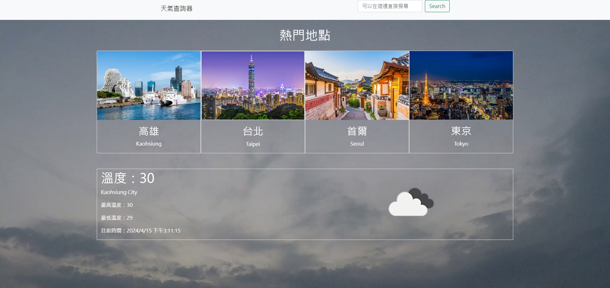
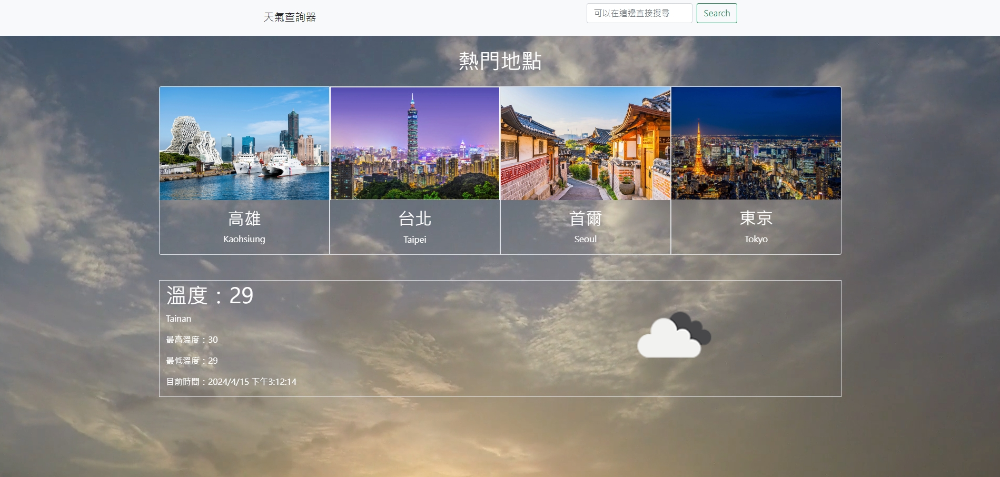

# 坐在家裡就可以知道天下的"WEATHER API"

### 專案畫面展示



## 專案說明

藉由這個東西
你只要在家就可以知道各地即時的天氣囉

## 專案功能


在這個專案中，您可以知道各地的天氣
除此之外幾個熱門的位址可以藉由上方的四個區域直接點選


如果您想查詢的位置並不在"熱門地區"當中也沒關係
直接透做右上角的搜尋即可找到！
想知道台南的天氣，直接搜尋"TAINAN"即可！

## 如何使用

```
1. 請先安裝npm還有nodemon，沒安裝? 就去安裝ㄅ^.<
```

```
2. 把這個專案clone到你的電腦中
```

```
3. 使用終端機開啟然後進到這個資料夾(cd weatherAPI)
```

```
4. 進入後在終端機輸入"npm run start"
```

```
5. 看見"gogo"的訊息時，打開瀏覽器進入網址"http://localhost:3000/"
```

```
6. 開始查詢您想了解的地區的天氣吧！
```

```
7. 要暫停請按"ctrl + c"
```
